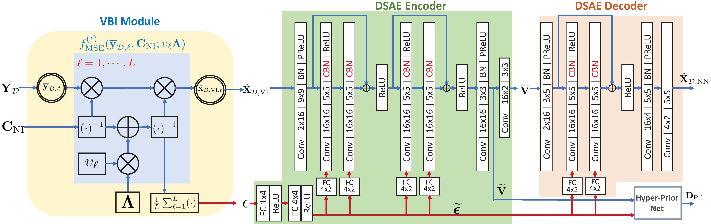
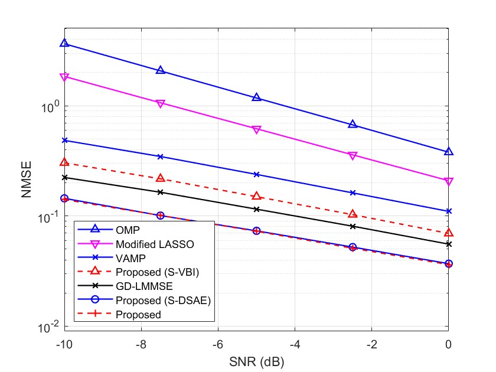
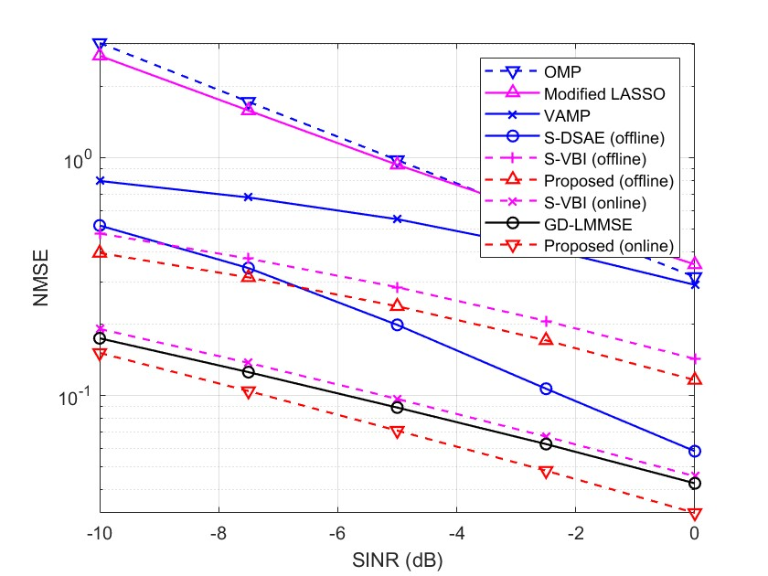

## Robust Deep Learning for Channel Estimation under Interference

This repository contains the source codes of the paper ``Robust Deep Learning for Uplink Channel Estimation in Cellular Network under Inter-Cell Interference'' which is published in IEEE Journal on Selected Areas in Communications (see <https://ieeexplore.ieee.org/abstract/document/10132590>).

In the paper, we propose a robust deep-learning-based channel estimation solution under inter-cell interference. The proposed DNN is a cascade of a model-based VBI-DNN module and a model-free Denoising Sparse Autoencoder (DSAE) DNN module, such that the time-varying ICI covariance is addressed. 

## Introduction of the codes

Run the files ``Fig13_plot.m'' and "Fig15_plot.m". You may get Fig.13 and Fig.15 in the paper verifying the performance related to offline training and online tracking, respectively.

### Code for Fig.13 about the offline training results

+ (Baseline 1)``Fig13_baseline_omp.m'': OMP 
+ (Baseline 2)``Fig13_baseline_lasso.m'': Modified LASSO
+ (Baseline 3)``Fig13_baseline_vamp.m'':  VAMP
+ (Baseline 4)``Fig13_vbi_pretrain.m'': GD-LMMSE

++++++++
+ (Proposed)``Fig13_vbi_pretrain.m'': S-VBI
+ (Proposed)``Fig13_offline_no_VBI_test.py'': S-DSAE
+ (Proposed)``Fig13_offline_test_est_mse.py'': Proposed

### Code for Fig.15 about the online training results

Pls first run "Fig15_combine_dataset.m" to get the channel for online training. Then, use "Fig15_online_batch_dataset.m" to generate online training and testing data.

+ (Baseline 1)``Fig15_baseline_OMP.m'': OMP 
+ (Baseline 2)``Fig15_baseline_LASSO.m'': Modified LASSO
+ (Baseline 3)``Fig15_baseline_vamp.m'':  VAMP
+ (Baseline 4)``Fig15_genie_LMMSE.m'': GD-LMMSE
+ (Baseline 5)``Fig15_no_VBI_test_ici_sinr.py'': S-DSAE (offline)

++++++++
+ (Proposed)``Fig15_online_test_sinr.py'': S-VBI (offline), S-VBI (online), Proposed (offline), Proposed (online)

## Note
You may cite us by   
@ARTICLE{10132590,
  author={Guo, Huayan and Lau, Vincent K. N.},
  journal={IEEE Journal on Selected Areas in Communications}, 
  title={Robust Deep Learning for Uplink Channel Estimation in Cellular Network under Inter-Cell Interference}, 
  year={Early Access, DOI:10.1109/JSAC.2023.3276765}
}
